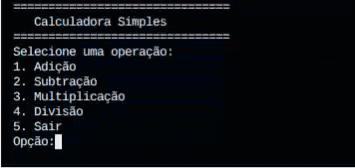

# C calculator
  The objective of this project is to enable most users to use a light calculator alternative.

  [License: MIT](https://github.com/FelipePatsche/Calculadora/blob/main/LICENSE.md)
  
  


## Prerequisites

  - gcc 10 or above (guaranteed)
  - stdio (default library)
    
### A little help

  If you don't know too much about coding or you don't have gcc downloaded, use this shortcut to download and/or learn more:
    [Neps Academy](https://neps.academy/br/course/introducao-a-programacao/lesson/instalando-a-ide)

## Instalation
1. Download everything is needed in the section [Prerequistes](#Prerequisites)
2. Download the project from [GitHub](https://github.com/FelipePatsche/Calculadora/archive/refs/heads/main.zip) or use git clone
3. Open your terminal in the project folder and execute this:
``` bash
gcc calculator.c -o <choosed-name>.exe
```
4. On Windows, execute to run:
```
.\<choosed-name>.exe
```
on Linux or Mac execute:
```
./<choosed-name>
```
## Examples
The first thing that apears is the interface. the user can select :
- to __add__ two numbers, with the number __'1'__;
- to __subtract__ two numbers, with the number __'2'__;
- to __multiply__ two numbers, with the number __'3'__;
- to __divide__ two numbers, with the number __'4'__;
-  to __exit__ with, the number __'5'__.
```interface
  ===============================
  Calculadora Simples
  ===============================
  Selecione uma operação:
  1. Adição
  2. Subtração
  3. Multiplicação
  4. Divisão
  5. Sair
  Opção:
  ```
When you choose, something like this will apear:
```
Digite o primeiro número:
```
So you write an integer or and decimal number for the __operated__, __only this__.

After that, apears:
```
Digite o segundo número: 
```
So you write an integer or and decimal number for the __operator__, __only this__.

Than the result apears, after that, it asks if you want to do other operation or exit ('s' to 'yes' and 'n' to 'no'):
```
===============================
Calculadora Simples
===============================
Selecione uma operação:
1. Adição
2. Subtração
3. Multiplicação
4. Divisão
5. Sair
Opção: 1
Digite o primeiro número: 2
Digite o segundo número: 1
Resultado: 3
Deseja realizar outra operação? (s/n): s
===============================
Calculadora Simples
===============================
Selecione uma operação:
1. Adição
2. Subtração
3. Multiplicação
4. Divisão
5. Sair
Opção: 5
Obrigado por usar a calculadora! Até a próxima.
```
Possible errors:
- You can't divide by 0;
- The bottom limit and the top limit for an integer or a decimal number is -2.147.483.648 and 2.147.483.647;
- It will respect up to 7 decimal digits.


## Structure
```Structure
  Calculadora/
      |-images/
          |_image.gif
      |-.gitignore
      |-LICENSE.md
      |-README.md
      |-calculator.c
```
## License

This project is under the MIT license.

You can access the license of this project by going to the LICENSE.md file or clicking on this shortcut: [License: MIT](https://github.com/FelipePatsche/Calculadora/blob/main/LICENSE.md)


